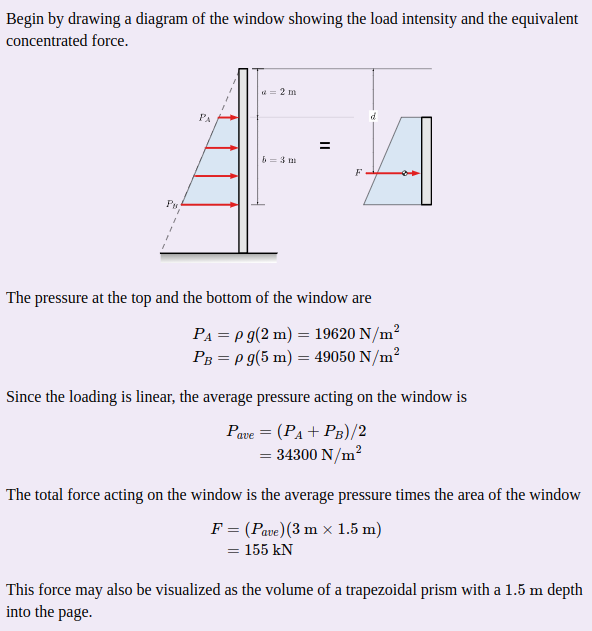

Due Friday 2 Oct, 1700, via Sakai. Textbook: Chapters 1 and 2 ([Textbook](../../resources/textbook.qmd)).

## Introductory Notes

### Save Programs as Live Code `.m` Files

As of MATLAB R2025a, both *traditional scripts* (plain-text programs) and *live scripts* (plain-text files that include formatted text, images, output, and so on) share the `.m` file extension, so the extension alone does not tell you what kind of file you have.

**For this course, all homework submissions must be live scripts** saved using the plain-text live code format (`.m`). If you are unsure, use **Save As** in the Live Editor and confirm the file type is set to `MATLAB Live Code File (UTF-8) (*.m)`.

### Submitting Your Work

Completing assignments typically consists of writing programs (scripts, live scripts, function files, and so on). These files are submitted by uploading them to the AE2440 Sakai site under the appropriate assignment. A few things will make the submission process run smoothly.

- **Check your work.** To ensure that your program runs in a clean workspace, before submitting your final solution execute the `clear` command and then run your program from an empty workspace. This helps avoid errors from undefined variables.
- **Exact file names.** Pay particular attention to the specified file names, including letter case (**programming is case-sensitive!**). The file names must be exactly as requested so that any automation on the evaluation end runs without a file-not-found error.
- **Live scripts, include output.** When submitting live scripts, first run your live script to generate all specified numeric data, figures, and so on as inline output within your text and code. Then save the file (which will include the output). This lets the instructor review your solution quickly, but also debug and re-run your code if necessary.

#### Verify Sakai Uploads

When you upload your files to Sakai, take an extra step to make sure the files you attach to your Sakai assignment are the files you intend. Use the steps below to verify your assignment before submission.

1. **Attach** the files:

   {width=600px}

2. **Save Draft.** You can use "Save Draft" if you have more work to do.
3. **Preview.** When you have attached all the files, select "Proceed", which takes you to a preview of the submission:

   {width=500px}

4. **Verify.** From this page you can download each attachment. Open each file locally to verify that the file attached to Sakai is the file you intend to submit.

### Simple Output

For the first few exercises, your program does not need to format its output. Instead, rely on MATLAB's default behavior: when a statement does **not** end with a semicolon (`;`), MATLAB displays the result in the Command Window. When a semicolon is present, the result is computed but not shown. For example, if you run `penny.m` from the command window, you should see something like this:

```
>> penny

t =

    8.8134

v =

   86.4594

>>
```

## Problem 1: Penny

Write a script named `penny.m` to solve Textbook Exercise 1.1.

Notes:

- Use **Save As** in the Live Editor and confirm the file type is set to `MATLAB Live Code File (UTF-8) (*.m)`.
- It is good engineering practice to include comments with a description and units. I typically do this by including the units in square brackets, for example:

  ```matlab
  % Time [s]
  t = ...
  ```

## Problem 2: Penny Revisited

Write a script named `pennywithair.m` to solve Textbook Exercise 1.2.

To explore the functionality of MATLAB's [live code format](https://www.mathworks.com/help/matlab/matlab_prog/plain-text-file-format-for-live-scripts.html), include at least the following elements:

- Two text blocks and two code blocks
- Text formats: Title and Normal
- Text items: at least one Equation

See MATLAB's [Format Text in Live Editor](https://www.mathworks.com/help/matlab/matlab_prog/format-live-scripts.html).

Hint: you may want to work out the mechanics of this problem first (define the model with pencil and paper) before implementing it in MATLAB. Here is an outline of the calculation.

- Write an expression for how long it takes an object under constant acceleration, with no air resistance, to reach a speed of $v_\text{term} = 18$ m/s.
- In that amount of time, how far does the object fall?
- How much distance is left to fall before it hits the sidewalk?
- How long does it take to travel that distance at a constant speed of $v_\text{term}$?

Tip: the keyboard shortcut (Ctrl+Enter or Alt+Enter) for toggling between text and code blocks is convenient.

## Problem 3: Bike Share

Write a script named `bike_update.m` to solve Textbook Exercise 2.2.

Again, it is often worthwhile to write out the model (what you are trying to do) before starting the computational implementation (how you are going to solve it).

## Problem 4: Fluid Statics

Write a script named `aquarium.m` to demonstrate a parameterized solution to the following statics problem from [Engineering Statics](https://engineeringstatics.org/). The goal of this exercise is to use MATLAB to implement the calculations associated with this statics problem. **The problem and the solution are given, so you do not need to solve (or even understand) the statics problem; just use MATLAB as a calculator to implement the given solution.**

An aquarium tank has a window AB for viewing the inhabitants. The width of the window is fixed at $w = 1.5$ m. The top of the window is shown as 2 m below the surface, but should be parameterized as the variable `a`. The height of the window is shown as 3 m, but should be considered variable `b`. The tank contains water with a density of $\rho = 1000$ kg/m^3^.

{width=400px}

Here is the solution:

{width=600px}

(Problem and solution from *Engineering Statics: Open and Interactive*, Baker and Haynes, [CC BY-NC-SA 4.0](https://creativecommons.org/licenses/by-nc-sa/4.0/).)

Implement this demonstration as a live script, using **alternating text and code blocks** to illustrate the steps as shown in the solution above. Test your implementation by defining the input variables as

```matlab
% Depth of the top of the window: distance from water surface to A in the diagram
a = 2.0;

% Height of the window: distance from A to B in the diagram.
b = 3.0;
```

Verify that you get the same solution as provided in the example.

### Submit and Verify

Submit your programs as separate files with the `.m` extension. Double-check all case-sensitive file names to make sure they are identical to the file names given in the exercises. See the submission process above.
