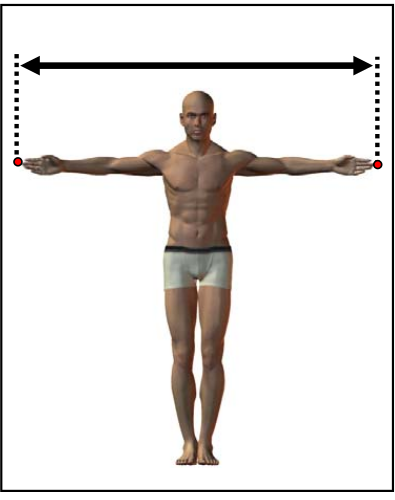
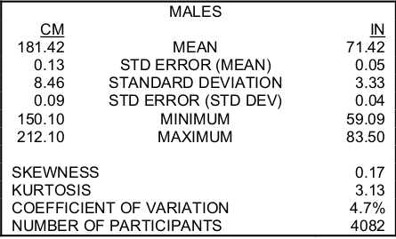
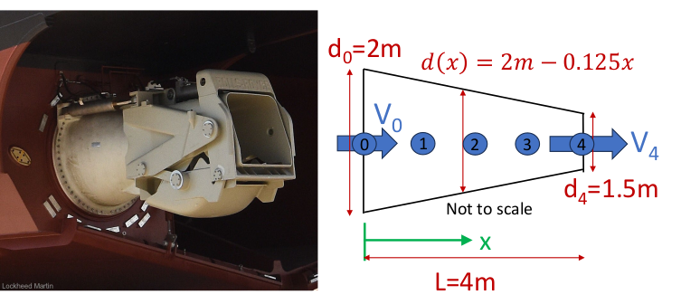

Due Friday 9 Oct, 1700, via [Sakai](). Textbook: Chapters 3 and 4 ([Textbook](../../resources/textbook.qmd)).

## Introductory Notes

Completing assignments typically consists of writing programs (scripts, live scripts, function files, and so on). These files are submitted by uploading them to the AE2440 Sakai site under the appropriate assignment. I will then attempt to execute your programs. A few things will make this process run smoothly.

- To ensure that your program runs in a clean workspace, before submitting your final solution execute the `clear` command and then run your program from an empty workspace. This helps avoid errors from undefined variables.
- Pay particular attention to the specified file names, including letter case. The file names must be exactly as requested so that any automation on the evaluation end runs without a file-not-found error.
- When submitting live scripts, first run your live script to generate all specified numeric data, figures, and so on as inline output within your text and code. **Then** save the file. This lets the instructor review your solutions quickly, but also debug and re-run your code if necessary.

See [Assignment 1](../w01_modeling_scripts/assignment.qmd) for the live-code `.m` format and the steps to verify a Sakai upload.

### MATLAB Operations

In these exercises we often use arithmetic operations directly with vectors, performing calculations on each element in the array. MATLAB distinguishes between array (element-wise) operations and matrix operations: see [Array vs. Matrix Operations](https://www.mathworks.com/help/matlab/matlab_prog/array-vs-matrix-operations.html). Later in the course we'll use MATLAB's matrix operations for linear algebra problems, but for these exercises it is important to understand the syntax of **array** operations.

## Problem 1: Bouncing Ball

Create a live script named `bounce.m` to solve the following problem.

A tennis ball dropped from a height $h_0 = 2$ m onto a hard floor. On each bounce it rebounds to a 60\% ($r=0.6$)of the height it fell from, so after the first bounce it rises to $0.6 h_0$, after the second to $0.6^2 h_0$, and so on. 

Use a loop to answer the following questions:

1. **How high does the ball go on bounce $N$?** The rebound heights $h_0,\ r h_0,\ r^2 h_0,\ \ldots$ are a *sequence*. To simulate this use a `for` loop: start with `h = h0` and update `h = r * h` each time through.
2. **How far does the ball travel in total?** The ball falls $h_0$, then rises and falls $r h_0$, then rises and falls $r^2 h_0$, and so on. The total distance is the *series*
   $$d = h_0 + 2 r h_0 + 2 r^2 h_0 + 2 r^3 h_0 + \cdots$$
   Accumulate it inside the same loop: add the up-and-down distance of each bounce to a cummulative sum.

Write your script to:

- Define the parameters `h0`, `r`, and the number of bounces `N = 20` at the top, with units in comments.
- Loop over the bounces, 1--N. On each iteration compute the new rebound height, add that bounce's contribution to the running total distance, and **plot the rebound height as one data point** (bounce number on the x-axis, height on the y-axis), adding one point to the figure each time through the loop. You will need `hold on` so each new point is added to the same axes rather than replacing the previous one.
- After the loop, display the total distance travelled using `disp`.

In a text block in your live script, answer the following questions:

- What is the first bounce for which the rebound height is less than 0.2 m?
- Does the total distance keep growing without limit as you increase `N`, or does it approach a value? Compare your loop's total for a large `N` to the closed-form result $d = h_0 \,\dfrac{1 + r}{1 - r}$ and comment on the agreement.

This is the same arithmetic as the "series" example in Chapter 3 of the textbook, with the ratio $1/2$ replaced by the variable `r`. Use plain scalar variables and a loop for this problem; we have not covered vectors yet, and the point is to see how a sequence and its running sum are built up one term at a time.

## Problem 2: Simple Statistics

Create a live script named `span_statistics.m` to report some summary statistics for data from the [Anthropometric Survey of US Army Personnel](https://www.openlab.psu.edu/ansur2/) (ANSUR) dataset. This exercise is an example of the common **reduce** pattern for vector operations discussed in [Chapter 4](../../resources/textbook.qmd).

The dataset comes from the Natick Soldier Research, Development and Engineering Center. The goal of the survey was to "acquire a large body of data from comparably measured males and females to serve the Army's current design and engineering needs, as well as those anticipated well into the future." We will use one of the 94 measurements they conducted on each soldier.

The data is a MAT-file: [ansur_span.mat](/book/w02_loops_vectors/assign/ansur_span.mat) (use the download button on GitHub). To load the data into your MATLAB workspace, make sure the file is in the current working directory of MATLAB, then use the command

```matlab
load("ansur_span.mat");
```

Verify that you now have a variable named `span` in your workspace. This variable is a vector where each element is a measurement of the arm span of an individual male in meters. What is the size and shape of the vector?

{width=300px}

Use a `for` loop (or multiple `for` loops) to calculate the following:

- mean:
  $$\mu = \bar{x} = \frac{\sum_{i=1}^{n} x_i}{n}$$
- standard deviation:
  $$\sigma = \sqrt{\frac{\sum_{i=1}^{n} (x_i - \mu)^2}{n - 1}}$$

There are standard MATLAB functions (`mean`, `sum` and `std`) for these vector operations, but for this exercise perform the calculation by iterating through the elements in the vector.

Note: `sum`, `mean` and `std` are all names of existing MATLAB functions, so use variable names that avoid naming collisions.

Verify that your answers are consistent with this table from the Army's report.

{width=450px}

## Problem 3: LCS Nozzle Flow

(Adapted from ME2201, courtesy of Professor Alley.)

Create a script named `lcs_flow.m` that creates two figures to plot the solution to the following fluid dynamics problem.

The LCS (both the -1 and -2 classes) are propelled by water-jet propulsion systems which extend out from the stern of the vessel. The nozzle contracts aft from the transom to the outlet, causing the fluid to accelerate.

{width=700px}

We can derive the following expressions for the velocity ($v$ in m/s) and acceleration ($a$ in m/s^2^) of the fluid as a function of $x$, the distance along the nozzle from 0 to 4 m, and $t$, time as the throttle is increased from 50% at $t = 0$ to full ahead at $t = 30$ s.

$$v(x,t) = \frac{(10 + 0.2t)\,\pi}{\frac{\pi}{4}\,(4 - 0.25x)^2}$$

$$a(x,t) = \frac{0.5}{(4 - 0.25x)^2} + \frac{0.5\,(24 + 0.5t)^2}{(2 - 0.125x)^5}$$

Running your script should result in two figure windows:

1. The first figure contains plots of the fluid velocity (y-axis) as a function of the distance $x$, where $x$ varies from 0 to 4 m. Each curve is a visualization of the function at a specific point in time. Plot four separate curves on the same axes: a curve for $t = 0$, $10$, $20$ and $30$ s.
2. The second figure contains plots of the fluid acceleration as a function of distance. Just as before, plot four separate curves for the acceleration at $t = 0$, $10$, $20$ and $30$ s.

Hints:

- You should only need to implement the mathematical models once for velocity and once for acceleration. If you find yourself doing it multiple times (using copy-paste), consider using a loop.
- You do not need to loop through the `x` values. MATLAB arithmetic can handle vectors directly; see [Array vs. Matrix Operations](https://www.mathworks.com/help/matlab/matlab_prog/array-vs-matrix-operations.html).

<!-- ## Problem 4: Approximating a Continuous Model and Simulating a Discrete Model

In this exercise you will model first-order decay, a pattern that describes many physical systems such as a cooling object, using two approaches in MATLAB. First you will plot an analytical solution by evaluating a formula over a vector of time points. Then you will approximate the same result step by step using a `for` loop.

The live script with instructions and starter code is provided: [decay_twoways.m](/book/w02_loops_vectors/assign/decay_twoways.m). Fill in the code blocks following the embedded instructions and submit your revised `decay_twoways.m` file. -->

### Submit and Verify

Submit your live-code files with the `.m` extension: `bounce.m`, `span_statistics.m`, `lcs_flow.m`.

Double-check all case-sensitive file names. See the submission process above.
